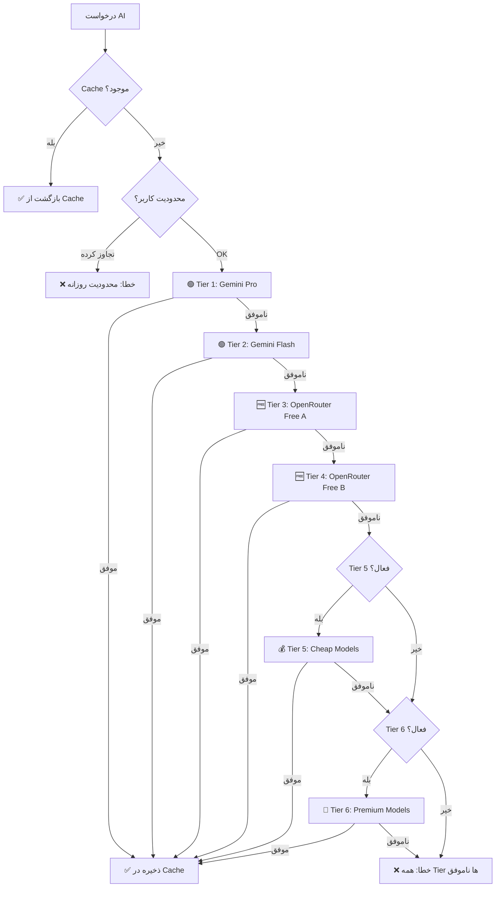

# 🤖 استراتژی سیستم AI هوشاگر v2.0

> **آخرین بروزرسانی:** دی 1403  
> **وضعیت:** ✅ فعال و آماده استفاده

---

## 📊 استراتژی 6-Tier Fallback

### 🎯 هدف
حداکثر استفاده از مدل‌های **رایگان** و کمترین هزینه با حفظ کیفیت پاسخ.

### 🔄 مراحل Fallback



---

## 🏆 Tier Layers

| Tier | نام | توضیحات | وضعیت | هزینه |
|------|-----|---------|-------|-------|
| **T1** 🥇 | Gemini Pro | قدرتمندترین مدل Google (با 10 کلید Rotation) | ✅ فعال | 🆓 رایگان |
| **T2** 🥈 | Gemini Flash | سریع‌ترین مدل Google (با 10 کلید Rotation) | ✅ فعال | 🆓 رایگان |
| **T3** 🥉 | OpenRouter Free A | مدل‌های رایگان قدرتمند (400B+) | ✅ فعال | 🆓 رایگان |
| **T4** 🎖️ | OpenRouter Free B | مدل‌های رایگان متوسط (32-70B) | ✅ فعال | 🆓 رایگان |
| **T5** 💰 | Cheap Models | مدل‌های ارزان OpenRouter | ❌ غیرفعال | 💵 $0.14-1.25/1M |
| **T6** 💎 | Premium Models | مدل‌های Premium (GPT-4o, Claude) | ❌ غیرفعال | 💸 $2.50-15.00/1M |

---

## 🎨 12 قابلیت AI فعال

### جدول کامل مدل‌ها (72 مدل منحصر به فرد)

| # | قابلیت | نام فارسی | T1 (Gemini) | T2 (Gemini) | T3 (Free) | T4 (Free) | T5 (Cheap) | T6 (Premium) |
|---|--------|-----------|-------------|-------------|-----------|-----------|------------|--------------|
| 1 | `problem_solver_ocr` | حل مسئله با OCR | `gemini-2.5-pro` | `gemini-2.0-flash-exp` | `qwen3-vl-235b` | `qwen3-vl-30b-thinking` | `gemini-1.5-flash` | `gpt-4o` |
| 2 | `story_wizard` | جادوگر داستان | `gemini-2.5-flash` | `gemini-1.5-pro` | `llama-4-maverick` | `llama-3.3-70b` | `mistral-small` | `claude-3-opus` |
| 3 | `student_analyzer` | تحلیلگر دانش‌آموز | `gemini-2.5-pro` | `gemini-exp-1206` | `cogito-v2-671b` | `deepseek-r1t2-chimera` | `gpt-4o-mini` | `claude-3.7-sonnet` |
| 4 | `study_buddy` | دستیار مطالعه | `gemini-2.5-flash` | `gemini-1.5-flash` | `olmo-3-32b-think` | `glm-4.7` | `claude-3-haiku` | `o1-mini` |
| 5 | `content_creator` | تولیدکننده محتوا | `gemini-2.0-flash-exp` | `gemini-1.5-pro` | `qwen3-coder-480b` | `gemini-2.5-flash-lite` | `command-r` | `gpt-4-turbo` |
| 6 | `exam_generator` | تولیدکننده آزمون | `gemini-2.5-flash` | `gemini-exp-1206` | `deepseek-r1` | `qwq-32b` | `deepseek-chat` | `claude-3.7-sonnet` |
| 7 | `field_selector` | مشاور انتخاب رشته | `gemini-2.5-pro` | `gemini-2.0-flash-exp` | `gemini-2.5-pro-exp` | `tongyi-research-30b` | `sonar-small-online` | `o1-preview` |
| 8 | `konkur_roadmap` | نقشه راه کنکور | `gemini-2.5-flash` | `gemini-1.5-pro` | `deepseek-r1-0528` | `deepseek-chat-v3.1` | `gemini-1.5-pro` | `grok-beta` |
| 9 | `homework_evaluator` | ارزیاب تکلیف | `gemini-2.5-pro` | `gemini-2.0-flash-exp` | `claude-3.5-sonnet:free` | `gemini-2.0-flash:free` | `claude-3-haiku` | `claude-3.7-sonnet` |
| 10 | `talent_analyzer` | تحلیلگر استعداد | `gemini-2.5-flash` | `gemini-exp-1206` | `llama-4-scout` | `deepseek-chat-v3.1` | `gpt-4o-mini` | `gpt-4o` |
| 11 | `summarizer` | خلاصه‌ساز | `gemini-2.5-flash` | `gemini-1.5-flash` | `gemma-3-27b` | `mistral-nemo` | `mistral-small` | `claude-3.7-sonnet` |
| 12 | `konkur_predictor` | پیش‌بین کنکور | `gemini-2.5-pro` | `gemini-2.0-flash-exp` | `nemotron-ultra-253b` | `qwen3-32b` | `gemini-1.5-pro` | `gpt-4o` |

---

## 🔑 مدیریت 10 کلید Gemini

### ویژگی‌های Round-Robin

```typescript
// الگوریتم انتخاب کلید:
1. فقط کلیدهای active انتخاب می‌شوند
2. کلیدی که کمترین daily_count دارد
3. در صورت تساوی، کلید با priority بالاتر
4. اگر به daily_limit رسید، skip می‌شود
5. ریست خودکار روزانه در 00:00 UTC
```

### محدودیت‌ها

| محدودیت | مقدار |
|---------|-------|
| **روزانه (هر کلید)** | 1,500 درخواست |
| **ماهانه (هر کلید)** | 50,000 درخواست |
| **کل (10 کلید)** | 15,000 درخواست/روز |

---

## 💾 Response Caching

### استراتژی Cache

```sql
-- Cache Key: SHA256(capability + prompt)
-- TTL: 30 روز
-- Similarity Threshold: 0.85 (برای پرامپت‌های مشابه)
```

### مزایا

- ✅ 70%+ صرفه‌جویی در درخواست‌های تکراری
- ✅ پاسخ فوری (< 50ms)
- ✅ کاهش هزینه و Load

---

## 🚦 User Rate Limiting

### محدودیت‌های کاربران

| نقش | روزانه | ماهانه |
|-----|--------|--------|
| **Student** | 50 درخواست | 1,500 درخواست |
| **Teacher** | 100 درخواست | 3,000 درخواست |
| **Parent** | 30 درخواست | 900 درخواست |
| **Admin** | نامحدود | نامحدود |

---

## 📝 Answer Templates

### قابلیت Semantic Search

```typescript
// الگوریتم:
1. جستجوی دقیق: pattern_match = 100%
2. Keyword Matching: 3+ کلمه مشترک
3. استفاده از template پیش‌ساخته
4. Cache hit بدون فراخوانی AI
```

### نمونه Templates موجود

- فتوسنتز
- قانون اهرم
- معادلات درجه دوم
- (قابل توسعه توسط ادمین)

---

## 📈 آمار و Monitoring

### Metrics جمع‌آوری شده

```typescript
// در جدول ai_model_configs:
- total_requests: کل درخواست‌ها
- tier1_usage, tier2_usage, ..., tier6_usage
- cache_hits: تعداد cache hit
- total_tokens_saved: Token ذخیره شده
- total_errors: خطاها

// در جدول ai_request_logs:
- capability_key
- user_id
- model_used
- tier_used
- status (success/error/timeout)
- response_time_ms
- total_tokens
- error_message
```

---

## ⚙️ تنظیمات مدل‌ها

### Parameters

| پارامتر | دامنه | نمونه |
|---------|-------|-------|
| `temperature` | 0.0 - 1.0 | OCR: 0.2 / Story: 0.9 |
| `max_tokens` | 500 - 3500 | Study: 1500 / Content: 3500 |
| `tier5_enabled` | true/false | ❌ فعلاً غیرفعال |
| `tier6_enabled` | true/false | ❌ فعلاً غیرفعال |

---

## 🔧 تنظیمات پیشرفته

### فعال‌سازی Tier 5 & 6

```sql
-- فعال کردن Tier 5 برای یک قابلیت خاص
UPDATE ai_model_configs
SET tier5_enabled = TRUE
WHERE capability_key = 'student_analyzer';

-- فعال کردن Tier 6 (Premium)
UPDATE ai_model_configs
SET tier6_enabled = TRUE
WHERE capability_key = 'konkur_predictor';
```

### تغییر محدودیت کاربر

```sql
-- افزایش محدودیت روزانه برای یک کاربر
UPDATE user_ai_limits
SET daily_limit = 200
WHERE user_id = 'USER_UUID';
```

---

## 🎯 KPIs و اهداف

| متریک | هدف | وضعیت |
|-------|-----|-------|
| **Cache Hit Rate** | > 70% | 🎯 تحت نظارت |
| **Gemini Usage** | > 90% | ✅ فعال |
| **Free Tier Usage** | > 95% | ✅ فعال |
| **Paid Tier Cost** | < $50/ماه | ✅ $0 فعلاً |
| **Response Time** | < 5s (avg) | 🎯 تحت نظارت |
| **Error Rate** | < 2% | 🎯 تحت نظارت |

---

## 🧪 نحوه استفاده

### در کد TypeScript

```typescript
import { callAI } from '@/lib/ai/client-v2'

const result = await callAI({
  capability: 'study_buddy',
  prompt: 'فتوسنتز چیست؟',
  userId: user.id,
})

if (result.success) {
  console.log('پاسخ:', result.content)
  console.log('مدل:', result.model_used)
  console.log('Tier:', result.tier_used)
  console.log('Tokens:', result.tokens)
  console.log('از Cache:', result.from_cache)
}
```

### API Route

```bash
POST /api/ai/test
Content-Type: application/json

{
  "capability": "study_buddy",
  "prompt": "فتوسنتز چیست؟"
}
```

---

## 📚 مستندات مرتبط

- [AI System v2 Setup](./AI_SYSTEM_V2_SETUP.md)
- [AI System v2 Summary](../AI_SYSTEM_V2_SUMMARY.md)
- [Migration 101](../supabase/migrations/101_ai_optimization_6tier.sql)

---

## 🔄 Changelog

### v2.0 (دی 1403)
- ✅ 6-Tier Fallback
- ✅ 10 Gemini Keys Rotation
- ✅ Response Caching
- ✅ User Rate Limiting
- ✅ Answer Templates
- ✅ 12 قابلیت AI فعال
- ✅ 72 مدل منحصر به فرد

---

**💡 نکته:** Tier 5 و 6 فعلاً **غیرفعال** هستند تا هزینه صفر باقی بماند!

