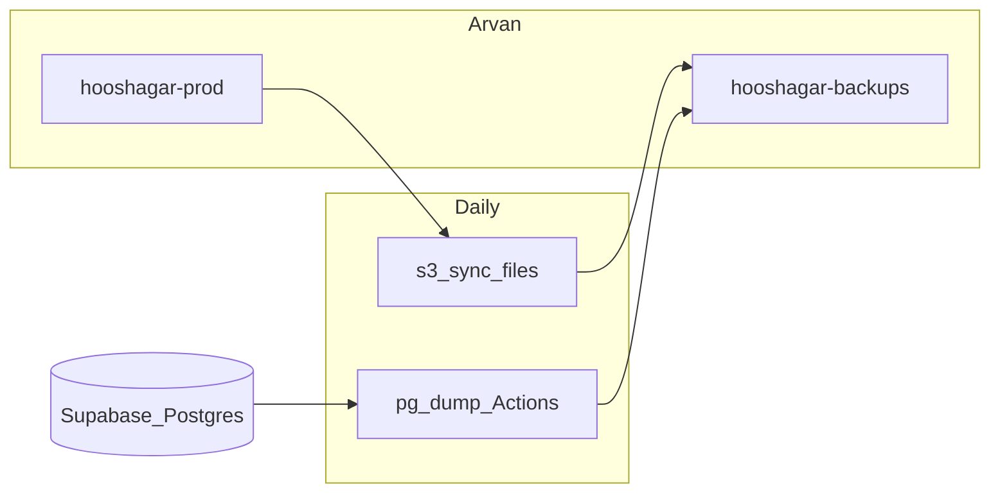

# نقشه راه سخت‌سازی بک‌آپ و ذخیره‌سازی — هوشاگر

**نسخه:** 1.0  
**وضعیت:** در حال اجرا (فازهای فنی ۱ و ۳ و ۴ توسط Agentهای دیگر)

مستندات مرتبط:
- [BACKUP_RUNBOOK.md](./BACKUP_RUNBOOK.md) — رویهٔ عملی dump / restore / چک هفتگی
- [PILOT_TEST_CHECKLIST.md](./PILOT_TEST_CHECKLIST.md) — چک‌لیست پایلوت (شامل Ops بک‌آپ)

---

## وضعیت فعلی

| لایه | وضعیت |
|------|--------|
| دیتابیس | Supabase Postgres؛ dump روزانه از طریق [`.github/workflows/db-backup.yml`](../.github/workflows/db-backup.yml) → باکت آروان |
| فایل‌های کاربر | باکت `hooshagar-prod` روی آروان؛ mirror روزانه در فاز ۳ (`files-backup.yml`) |
| مانیتورینگ | وضعیت workflow در GitHub Actions + چک هفتگی پنل آروان |
| `backup_logs` | جدول migration موجود است؛ **پر کردن از CI خارج از این پلن** (برای پایلوت لازم نیست) |
| رمزنگاری dump | فعلاً همان `sql.gz` داخل باکت خصوصی؛ encryption جدا خارج از scope |

---

## اهداف RPO / RTO

| معیار | هدف |
|--------|------|
| **RPO** | حداکثر ۲۴ ساعت (dump روزانه + در صورت Pro، بک‌آپ پلتفرم) |
| **RTO** | چند ساعت (با کمک توسعه‌دهنده؛ restore روی پروژهٔ تست سپس cutover کنترل‌شده) |

---

## خارج از scope (ثابت)

- تعویض ارائه‌دهندهٔ آروان یا Supabase
- معماری storage از صفر
- PITR (Point-in-Time Recovery) مگر بودجهٔ جدا و تصمیم صریح
- DR چندمنطقه‌ای
- encryption جدا برای dump (فراتر از باکت خصوصی)
- مهاجرت دسته‌جمعی ACL برای آبجکت‌های قدیمی
- پر کردن جدول `backup_logs` از GitHub Actions

---

## تصمیم‌های قفل‌شده

| موضوع | تصمیم |
|--------|--------|
| استراتژی DB | **A′** (اختیاری / فاز ۵ — Pro) + **B** (dump روزانه به آروان) — RPO ۲۴س |
| باکت بک‌آپ | `hooshagar-backups` (خصوصی)، retention **۶۰ روز** |
| باکت فایل | `hooshagar-prod`؛ mirror روزانه به prefix `files/` داخل باکت بک‌آپ (یا باکت `hooshagar-prod-mirror`) |
| Lifecycle فایل‌ها | prune جدا برای prefix `files/` لازم نیست اگر lifecycle باکت ۶۰روزه است |
| هشدار fail | Job Summary در Actions + نوتیفیکیشن ایمیل GitHub برای maintainerها (بدون سرویس جدید) |
| ACL | `logo` و `avatar` عمومی؛ بقیه (`ocr`, `document`, `attachment`, `report`, `art-sample`, `story-image`, `misc`) بدون public-read + سرو با signed URL |
| متادیتای فایل | `file_path` منبع حقیقت؛ `file_url` برای عمومی = CDN URL و برای خصوصی خالی/path |
| Pro / restore تست | کار انسانی؛ چک‌باکس در این سند، نه کد |
| مسیر رسمی dump | **GitHub Actions**؛ مسیر محلی = `pnpm db:dump` + AWS CLI به آروان (بدون اسکریپت مفقود) |

---

## Secrets و پیش‌نیازها

### GitHub Actions secrets

| Secret | توضیح |
|--------|--------|
| `SUPABASE_DB_URL` | Session pooler (پورت ۵۴۳۲، host با `pooler`). Direct روی Actions به‌خاطر IPv6 معمولاً fail می‌شود. Transaction (۶۵۴۳) برای dump مناسب نیست. اگر پسورد `@` دارد → `%40`. ترجیحاً `?sslmode=require` |
| `ARVAN_ACCESS_KEY` | کلید دسترسی آروان |
| `ARVAN_SECRET_KEY` | رمز آروان |
| `ARVAN_ENDPOINT` | مثلاً `https://s3.ir-thr-at1.arvanstorage.ir` |
| `ARVAN_BACKUP_BUCKET` | باکت بک‌آپ، مثلاً `hooshagar-backups` |
| `ARVAN_BUCKET` | باکت production فایل‌ها، مثلاً `hooshagar-prod` (برای workflow mirror فایل) |

### پیش‌نیازهای آروان

- [ ] باکت `hooshagar-backups` ساخته شده و **عمومی نیست**
- [ ] Lifecycle: حذف آبجکت‌های قدیمی‌تر از ۶۰ روز
- [ ] باکت `hooshagar-prod` برای فایل‌های اپلیکیشن موجود است
- [ ] کلیدهای دسترسی برای dump و sync کافی‌اند (read روی prod، write روی backups)

### پیش‌نیازهای GitHub

- [ ] همهٔ secrets بالا در Settings → Secrets and variables → Actions تنظیم شده‌اند
- [ ] نوتیفیکیشن Actions برای maintainerها فعال است: **Settings → Notifications** و/یا Watching ریپو برای workflow failures
- [ ] Workflowهای `Database Backup` و `Files Backup` حداقل یک‌بار با `workflow_dispatch` تست شده‌اند

---

## فاز ۰ — آماده‌سازی Ops (انسان / Ops)

**Owner:** Ops / انسان  
**وابستگی:** هیچ  
**معیار Done:** باکت خصوصی + secrets + نوتیفیکیشن Actions تأیید شده

- [ ] باکت `hooshagar-backups` ساخته و خصوصی است
- [ ] Lifecycle ۶۰ روز روی باکت بک‌آپ فعال است
- [ ] Secrets GitHub (`SUPABASE_DB_URL`, `ARVAN_*`) تنظیم و یک dump دستی موفق شده
- [ ] Watching / Notifications برای failure ورک‌فلو Actions فعال است
- [ ] وجود آخرین dump در پنل آروان تأیید شده (چک [PILOT_TEST_CHECKLIST.md](./PILOT_TEST_CHECKLIST.md) بخش Ops)

---

## فاز ۱ — اعتماد به بک‌آپ DB (Dev)

**Owner:** Dev  
**وابستگی:** فاز ۰ (secrets + باکت)  
**معیار Done:** در صورت failure، Job Summary واضح در Actions نوشته می‌شود؛ منطق dump بدون تغییر غیرضروری

- [ ] Step با `if: failure()` در [`.github/workflows/db-backup.yml`](../.github/workflows/db-backup.yml) که تاریخ و مرحلهٔ شکست را در Job Summary بنویسد
- [ ] تأیید: اجرای عمدی fail یا بازبینی run ناموفق → Summary خوانا است
- [ ] (انسان) نوتیفیکیشن ایمیل GitHub برای maintainerها روشن است — نگاه به بخش پیش‌نیازهای GitHub

---

## فاز ۲ — تست restore ماهانه (انسان)

**Owner:** انسان / DevOps  
**وابستگی:** حداقل یک dump موفق در باکت  
**معیار Done:** حداقل یک ردیف در جدول لاگ restore زیر پر شده؛ جزئیات رویه در [BACKUP_RUNBOOK.md](./BACKUP_RUNBOOK.md) بخش ۳

- [ ] دانلود آخرین dump از باکت بک‌آپ
- [ ] Restore روی پروژهٔ **تست** Supabase (نه production)
- [ ] شمارش جداول کلیدی (`profiles`, `students`, `schools`)
- [ ] ثبت نتیجه در جدول لاگ زیر (و در صورت تمایل در runbook)

### لاگ تست restore

| تاریخ | فایل بک‌آپ | پروژهٔ تست | نتیجه | امضا |
|-------|------------|------------|--------|------|
| | | | | |

---

## فاز ۳ — mirror فایل‌ها (Dev)

**Owner:** Dev  
**وابستگی:** فاز ۰ (`ARVAN_BUCKET` + `ARVAN_BACKUP_BUCKET`)  
**معیار Done:** workflow روزانه `files-backup.yml` با `aws s3 sync` به prefix `files/` و Job Summary در failure

- [ ] افزودن [`.github/workflows/files-backup.yml`](../.github/workflows/files-backup.yml)
- [ ] cron روزانه (~۳۰ دقیقه بعد از DB dump؛ مثلاً `0 2 * * *` UTC)
- [ ] `aws s3 sync` از `ARVAN_BUCKET` (prod) به `ARVAN_BACKUP_BUCKET` با prefix `files/`
- [ ] Job Summary در failure (مشابه فاز ۱)
- [ ] یک اجرای دستی موفق و تأیید آبجکت‌ها در پنل آروان

---

## فاز ۴ — ACL خصوصی و signed URL (Dev)

**Owner:** Dev  
**وابستگی:** هیچ (مستقل از dump؛ ترجیحاً بعد از پایدار شدن آپلود)  
**معیار Done:** آپلود جدید برای انواع حساس بدون `public-read`؛ لوگو/آواتار عمومی؛ مسیر خواندن با signed URL

فایل‌های هدف (پیاده‌سازی جدا): `lib/arvan-storage.ts`, `app/api/upload/route.ts`, callers مستقیم (مثلاً branding برای لوگو)

- [ ] `publicRead` یا تشخیص از `FileType`: عمومی فقط `avatar` / `logo`
- [ ] انواع خصوصی بدون `ACL: public-read`؛ پاسخ API شامل `path` و در صورت نیاز `signedUrl` کوتاه‌عمر
- [ ] متادیتا: `file_path` منبع حقیقت؛ `file_url` برای عمومی CDN و برای خصوصی خالی/path
- [ ] بدون بازنویسی آبجکت‌های قدیمی در آروان
- [ ] `pnpm` type-check روی تغییرات TypeScript

---

## فاز ۵ — ارتقا Supabase Pro (اختیاری / انسان)

**Owner:** انسان / مدیریت  
**وابستگی:** بودجه  
**معیار Done:** Daily backups در داشبورد Supabase تأیید شده (اگر ارتقا انجام شد)

- [ ] تصمیم بودجه برای پلن Pro
- [ ] Upgrade در Project Settings → Billing (در صورت تأیید)
- [ ] تأیید وجود Daily backups در Database → Backups
- [ ] PITR فعلاً لازم نیست مگر دادهٔ بسیار حساس و بودجهٔ جدا

جزئیات رویه: [BACKUP_RUNBOOK.md](./BACKUP_RUNBOOK.md) بخش ۱.

---

## ترتیب اجرای پیشنهادی

1. فاز ۰ (Ops) — باکت + secrets + نوتیف
2. فاز ۱ — harden `db-backup.yml`
3. فاز ۳ — `files-backup.yml`
4. فاز ۴ — ACL / signed URL
5. فاز ۲ — اولین restore تست (و تکرار ماهانه)
6. فاز ۵ — Pro در صورت بودجه

Commit فقط با درخواست صریح کاربر.

---

## معیار اتمام این دور مستندسازی

- [x] این سند با فازهای ۰–۵ و چک‌باکس در ریپو
- [x] لینک به runbook و چک‌لیست پایلوت
- [x] جدول secrets، خارج از scope، RPO/RTO، تصمیم‌های قفل‌شده
- [x] لاگ تست restore خالی
- [ ] تکمیل چک‌باکس‌های اجرایی فازها (کار Ops / Dev / انسان در Agentهای بعدی یا دستی)
