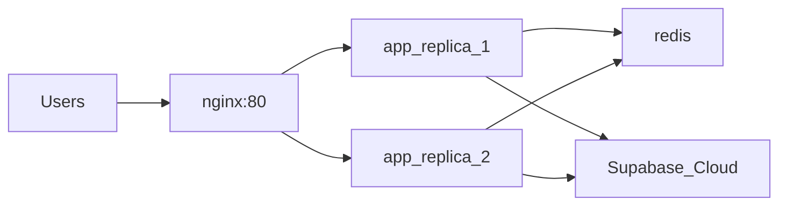

# استقرار هوشاگر با Docker روی VPS اوبونتو

راهنمای اجرای **چند کانتینر** روی VPS. دیتابیس و Auth روی **Supabase Cloud** می‌مانند.

## معماری Production (پیش‌فرض)



| کانتینر | تعداد | پورت بیرونی | نقش |
|---------|-------|-------------|-----|
| **nginx** | 1 | 80, 443 | HTTPS، load balance |
| **app** | 2 | — (داخلی) | Next.js |
| **redis** | 1 | — (داخلی) | cache آماده |
| **uptime-kuma** | 1 | 3001 | مانیتورینگ |
| **portainer** | 1 | 9443 | مدیریت Docker |

**حداقل VPS پیشنهادی:** 16GB RAM، 6 vCPU، 120GB SSD

---

## پیش‌نیاز

- VPS اوبونتو + Docker Compose v2
- کلیدهای Supabase و AI از [`env.example`](../env.example)

```bash
bash scripts/vps-setup.sh
```

---

## دریافت کد

```bash
cd ~
git clone git@github.com:HooshagarOrg/Hooshagar-Ai-Academy.git hooshagar
cd hooshagar
```

---

## تنظیم `.env`

```bash
cp env.example .env
nano .env
```

**حداقل اجباری:** `NEXT_PUBLIC_SUPABASE_URL`, `NEXT_PUBLIC_SUPABASE_ANON_KEY`, `SUPABASE_SERVICE_ROLE_KEY`, `GOOGLE_API_KEY`

**Production (از طریق nginx):**

```env
NODE_ENV=production
NEXT_PUBLIC_APP_URL=http://YOUR_SERVER_IP
NEXTAUTH_URL=http://YOUR_SERVER_IP
REDIS_URL=redis://redis:6379
NEXT_TELEMETRY_DISABLED=1
```

> `NEXT_PUBLIC_*` در **build** داخل image می‌روند — بعد از تغییر: `docker compose up -d --build`

---

## اجرا — Production (چند کانتینر)

```bash
cd ~/hooshagar
bash scripts/docker-deploy.sh
```

یا دستی:

```bash
docker compose build app
docker compose up -d
docker compose ps
```

**دسترسی:**

| سرویس | آدرس |
|--------|------|
| اپ (کاربران) | `http://YOUR_SERVER_IP` |
| Uptime Kuma | `http://YOUR_SERVER_IP:3001` |
| Portainer | `https://YOUR_SERVER_IP:9443` |

**لاگ:**

```bash
docker compose logs -f app nginx
```

---

## حالت ساده (۱ کانتینر، پورت 3000)

برای تست اولیه:

```bash
bash scripts/docker-deploy-single.sh
# تست: http://YOUR_SERVER_IP:3000
sudo ufw allow 3000/tcp
```

---

## Supabase (اجباری برای لاگین)

[Supabase Dashboard](https://supabase.com/dashboard) → Authentication → URL Configuration:

| فیلد | Production (nginx) |
|------|---------------------|
| Site URL | `http://YOUR_SERVER_IP` |
| Redirect URLs | `http://YOUR_SERVER_IP/**` |

با دامنه: `https://yourdomain.com` و `https://yourdomain.com/**`

---

## دامنه + HTTPS

1. `server_name` را در [`deploy/nginx/docker.conf`](../deploy/nginx/docker.conf) ویرایش کنید
2. گواهی SSL را mount کنید به volume `nginx-certs` یا از certbot روی host
3. `.env` را به `https://yourdomain.com` به‌روز کنید
4. `docker compose up -d --build`

---

## به‌روزرسانی

```bash
git pull
docker compose build app
docker compose up -d
```

---

## عیب‌یابی

| مشکل | راه‌حل |
|------|--------|
| فقط ۱ replica از app | `docker compose up -d --scale app=2` |
| nginx 502 | `docker compose logs app` — منتظر healthy شدن app بمانید |
| Build: `supabaseKey is required` | `.env` با کلیدهای واقعی + rebuild |
| `pnpm build` ویندوز: `EPERM symlink` | build فقط روی Linux/VPS |
| پورت 80 بسته | `ufw allow 80` + Security Group پنل VPS |
| لاگین redirect اشتباه | Supabase URLs + `NEXT_PUBLIC_APP_URL` |

---

## فایل‌ها

| فایل | نقش |
|------|-----|
| [`docker-compose.yml`](../docker-compose.yml) | Production: nginx + 2×app + redis + monitoring |
| [`docker-compose.single.yml`](../docker-compose.single.yml) | تک‌کانتینر روی 3000 |
| [`deploy/nginx/docker.conf`](../deploy/nginx/docker.conf) | تنظیم nginx داخل Docker |
| [`Dockerfile`](../Dockerfile) | Build اپ Next.js |

**Redis:** کانتینر آماده است؛ اتصال اپ از `REDIS_URL` — یکپارچه‌سازی کامل cache در نسخه بعدی.
