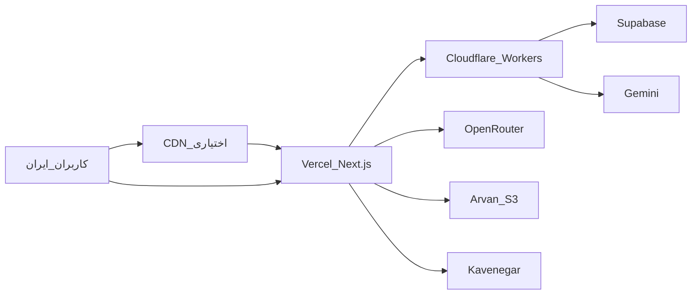

# استقرار هوشاگر روی Vercel (Production)

راهنمای قدم‌به‌قدم deploy اپ Next.js روی Vercel با Supabase ابری و Cloudflare Workers برای کاربران ایران.

## معماری



---

## پیش‌نیاز

| مورد | وضعیت |
|------|--------|
| حساب [Vercel](https://vercel.com) | Pro توصیه می‌شود برای production |
| پروژه [Supabase](https://supabase.com) | migrations اعمال‌شده |
| Repo GitHub | `HooshagarOrg/Hooshagar-Ai-Academy` |
| حساب Cloudflare | برای proxy ایران — [راهنما](./CLOUDFLARE_PROXY_SETUP.md) |
| دامنه (اختیاری) | مثلاً `hooshagar.ir` |

---

## فاز ۱ — آماده‌سازی کد (لپ‌تاپ)

```powershell
cd D:\hooshagar-project

# تست build محلی
pnpm install
pnpm build

# push به GitHub
git status
git push origin master
```

اگر `pnpm build` خطا داد، قبل از Vercel رفع کنید.

---

## فاز ۲ — اتصال Vercel به GitHub

1. برو به [vercel.com/new](https://vercel.com/new)
2. **Import Git Repository** → GitHub → `Hooshagar-Ai-Academy`
3. تنظیمات پروژه:

| فیلد | مقدار |
|------|--------|
| Framework Preset | **Next.js** |
| Root Directory | `./` |
| Build Command | `pnpm build` |
| Install Command | `pnpm install` |
| Output Directory | (خالی — Next.js خودکار) |

4. **Environment Variables** را هنوز deploy نکنید — اول envها را بگذارید (فاز ۳)

---

## فاز ۳ — متغیرهای محیطی در Vercel

**Dashboard → Project → Settings → Environment Variables**

همه را برای **Production** (و ترجیحاً Preview) اضافه کنید. از [`.env.local`](../.env.local) یا [`env.example`](../env.example) کپی کنید.

### اجباری

```env
# Supabase
NEXT_PUBLIC_SUPABASE_URL=https://xxxxx.supabase.co
NEXT_PUBLIC_SUPABASE_ANON_KEY=eyJ...
SUPABASE_SERVICE_ROLE_KEY=eyJ...

# اپ
NEXT_PUBLIC_APP_URL=https://yourdomain.com
NEXT_PUBLIC_APP_NAME=هوشاگر
NEXTAUTH_URL=https://yourdomain.com
NEXTAUTH_SECRET=حداقل_۳۲_کاراکتر_تصادفی
JWT_SECRET=حداقل_۳۲_کاراکتر_تصادفی

# AI — لایه ۱
GOOGLE_API_KEY=AIzaSy...
# تا ۱۰ کلید (اختیاری ولی توصیه‌شده)
GOOGLE_API_KEY_2=...
GOOGLE_API_KEY_3=...

# AI — fallback لایه ۲–۴
OPENROUTER_API_KEY=sk-or-v1-...
OPENROUTER_API_KEY_B=sk-or-v1-...
OPENROUTER_API_KEY_C=sk-or-v1-...
```

### proxy ایران (توصیه‌شده برای production)

```env
NEXT_PUBLIC_SUPABASE_PROXY=https://supabase-proxy.YOUR_SUBDOMAIN.workers.dev
NEXT_PUBLIC_GEMINI_PROXY=https://gemini-proxy.YOUR_SUBDOMAIN.workers.dev
```

راه‌اندازی Workers: [CLOUDFLARE_PROXY_SETUP.md](./CLOUDFLARE_PROXY_SETUP.md)

### سرویس‌های ایرانی

```env
KAVENEGAR_API_KEY=...
KAVENEGAR_SENDER=...
# زرین‌پال — نام متغیرها را از .env.local خود بگیرید
```

### Storage (Arvan)

```env
ARVAN_ACCESS_KEY=...
ARVAN_SECRET_KEY=...
ARVAN_ENDPOINT=s3.ir-thr-at1.arvanstorage.ir
ARVAN_BUCKET=hooshagar
```

### اختیاری

```env
NEXT_PUBLIC_RECAPTCHA_SITE_KEY=...
RECAPTCHA_SECRET_KEY=...
SKYROOM_API_KEY=...
UPSTASH_REDIS_REST_URL=...
UPSTASH_REDIS_REST_TOKEN=...
NEXT_TELEMETRY_DISABLED=1
```

> **Sentry:** فقط اگر `SENTRY_AUTH_TOKEN` + `SENTRY_ORG` + `SENTRY_PROJECT` دارید.

---

## فاز ۴ — Deploy

1. Vercel Dashboard → **Deployments** → **Redeploy** (یا اولین Deploy)
2. منتظر build بمانید (~۵–۱۵ دقیقه)
3. URL موقت: `https://hooshagar-xxxxx.vercel.app`

### تست سلامت

```bash
curl https://YOUR_VERCEL_URL.vercel.app/api/health
```

پاسخ مورد انتظار: `"status": "healthy"`

---

## فاز ۵ — Supabase

[Supabase Dashboard](https://supabase.com/dashboard) → **Authentication** → **URL Configuration**:

| فیلد | مقدار |
|------|--------|
| Site URL | `https://yourdomain.com` |
| Redirect URLs | `https://yourdomain.com/**` |

همچنین URL موقت Vercel را برای تست اضافه کنید:
```
https://hooshagar-xxxxx.vercel.app/**
```

**Migrations** (اگر جدید است):
```bash
npx supabase link --project-ref YOUR_PROJECT_ID
npx supabase db push
```

---

## فاز ۶ — دامنه سفارشی

### A) مستقیم روی Vercel

1. Vercel → **Settings** → **Domains** → Add `yourdomain.com`
2. DNS را طبق راهنمای Vercel تنظیم کنید (معمولاً CNAME به `cname.vercel-dns.com`)
3. SSL خودکار فعال می‌شود
4. `NEXT_PUBLIC_APP_URL` و `NEXTAUTH_URL` را به دامنه نهایی به‌روز کنید
5. **Redeploy**

### B) CDN ایرانی + Vercel (توصیه برای کاربران ایران)

```
کاربر → hooshagar.ir (آروان CDN) → origin: Vercel
```

1. در آروان CDN، origin را به URL پروژه Vercel بگذارید
2. SSL را روی CDN یا Vercel فعال کنید
3. `NEXT_PUBLIC_APP_URL=https://hooshagar.ir`

---

## فاز ۷ — Cloudflare Workers (کاربران ایران)

بدون proxy، Supabase و Gemini از ایران ممکن است فیلتر باشند.

1. Workers را deploy کنید: [CLOUDFLARE_PROXY_SETUP.md](./CLOUDFLARE_PROXY_SETUP.md)
2. URLهای proxy را در Vercel env بگذارید
3. Redeploy

---

## فاز ۸ — بعد از deploy

| کار | توضیح |
|-----|--------|
| کاوه‌نگار | template SMS را روی دامنه زنده تأیید کنید |
| زرین‌پال | callback URL = `https://yourdomain.com/...` |
| reCAPTCHA | دامنه production را در Google Console اضافه کنید |
| تست لاگین | OTP / ورود با نقش‌های مختلف |
| تست AI | یک قابلیت مثل Study Buddy |

---

## به‌روزرسانی

هر `git push` به `master` → deploy خودکار (اگر Git integration فعال است).

دستی:
```bash
npx vercel --prod
```

یا Vercel Dashboard → Deployments → Redeploy

---

## Rollback

Vercel → **Deployments** → deployment قبلی → **Promote to Production**

---

## عیب‌یابی

| مشکل | راه‌حل |
|------|--------|
| Build fail | لاگ Vercel؛ env گم‌شده یا TypeScript error |
| لاگین کار نمی‌کند | Supabase Redirect URLs + `NEXT_PUBLIC_APP_URL` |
| AI از ایران کار نمی‌کند | Cloudflare Workers proxy |
| 500 در API | لاگ Vercel Functions؛ `SUPABASE_SERVICE_ROLE_KEY` |
| تغییر env بدون اثر | Redeploy بعد از تغییر env |

### لاگ‌ها

- Vercel Dashboard → Project → **Logs**
- Runtime Logs برای API routes

---

## هزینه تقریبی ماهانه

| سرویس | هزینه |
|--------|--------|
| Vercel Pro | ~۲۰ دلار |
| Supabase (شروع) | ۰–۲۵ دلار |
| Cloudflare Workers | رایگان (سقف بالا) |
| Gemini (لایه ۱) | ~۰ دلار (free tier) |
| OpenRouter free | ~۰ دلار |
| **جمع شروع** | **~۲۰–۵۰ دلار/ماه** |

---

## چک‌لیست نهایی

- [ ] `pnpm build` محلی موفق
- [ ] همه envهای اجباری در Vercel
- [ ] Supabase URL Configuration
- [ ] Cloudflare Workers (برای ایران)
- [ ] دامنه + SSL
- [ ] `/api/health` → healthy
- [ ] لاگین + یک قابلیت AI تست شد
- [ ] کاوه‌نگار / زرین‌پال روی دامنه زنده

---

## مستندات مرتبط

- [DEPLOYMENT.md](./DEPLOYMENT.md) — نسخه انگلیسی
- [CLOUDFLARE_PROXY_SETUP.md](./CLOUDFLARE_PROXY_SETUP.md) — proxy ایران
- [DOCKER_VPS.md](./DOCKER_VPS.md) — فقط تست/استیجینگ
